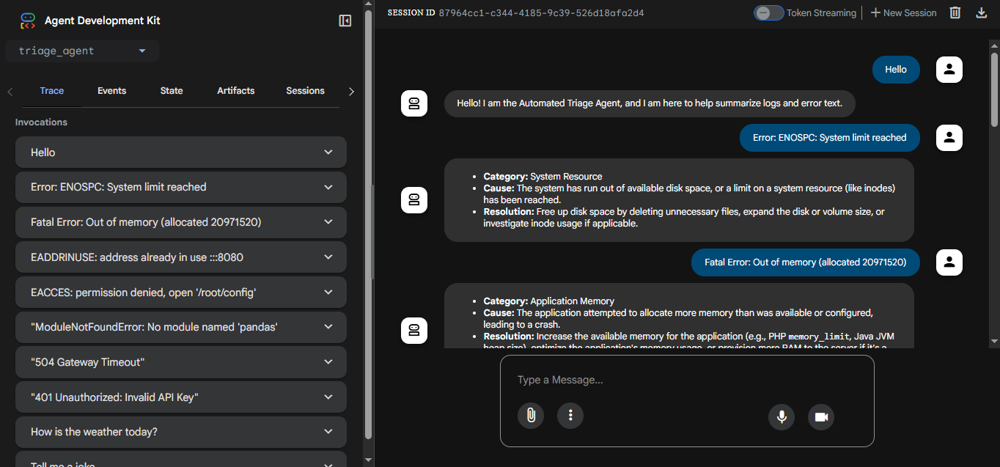

# 🛡️ Project: Automated Triage Agent
**GenAI Academy - Professional Project Submission**

## 🎯 Problem Statement
Build and deploy a *single AI agent* using *ADK and Gemini* that is hosted on *Cloud Run* and performs *one clearly defined task*. The agent must be callable via an HTTP endpoint and return a valid response for a given input.

This is a mini project focused on agent structure and deployment, showcasing a production-ready serverless AI workflow.

## 📋 Project Scope
This project focuses on the development and deployment of an intelligent **Senior DevOps Triage Agent**. The core objective was to create a specialized AI tool capable of transforming raw, chaotic error logs into structured, actionable insights while maintaining strict operational guardrails.

### 🎯 What We Achieved:
* **Single Capability Focus:** Specialized in **Classification and Summarization** of technical error logs.
* **Intelligent Log Analysis:** Leveraged **Gemini 1.5 Flash** to parse system errors into a standardized 3-point report (Category, Cause, Resolution).
* **Custom Persona & Guardrails:** Configured the agent to ignore non-technical queries, ensuring it remains a focused enterprise tool.
* **Cloud-Native Serverless Architecture:** Deployed via **Google Cloud Run** for automatic scaling and high availability.
* **Enterprise Identity Management:** Implemented a dedicated **IAM Service Account** with scoped permissions to Vertex AI, adhering to the Principle of Least Privilege.

---

## 🛠️ Technical Implementation

### 1. The Agent Logic (`agent.py`)
The agent is built using the **Google Agent Development Kit (ADK)**. It is programmed with a system instruction set that handles four critical states:
1.  **Greeting:** Identifies itself and its purpose immediately upon connection.
2.  **Triage Processing:** Extracts technical context and classifies raw input logs.
3.  **Formatting:** Returns responses in clean, structured Markdown (Bold headers and bullet points).
4.  **Scope Guarding:** Rejects requests outside the DevOps triage domain to maintain focus.

### 2. Infrastructure Stack
* **Compute:** Google Cloud Run (Exposed via HTTP Endpoint)
* **AI Engine:** Vertex AI (Gemini 1.5 Flash)
* **Environment:** Python 3.11 / UV Virtual Environment
* **Identity:** Custom IAM Service Account (`triage-service-auth`)

---

## Implementation Guide

Full setup steps are available here:

[Implementation Steps](docs/implementation_steps.md)

---

## 🌐 Accessing the Agent (ADK Web UI)
Upon successful deployment, the terminal will output a public Service URL.
(Example: https://automated-triage-agent-12345abcde-uc.a.run.app)
Click or paste this URL into your web browser.
The link will automatically load the ADK Web UI, providing a clean, built-in chat interface.
You can immediately start interacting with the Triage Agent directly on the UI using the test cases below.

| # | User Input | Expected Response (Approximate) | Purpose |
| :--- | :--- | :--- | :--- |
| 1 | `"Hello"` | "Hello! I am the Automated Triage Agent. I help summarize logs and error text." | Greeting Validation |
| 2 | `"ModuleNotFoundError: No module named 'pandas'"` | "**Category:** Dependency    **Cause:** The Python interpreter could not find the 'pandas' module because it is not installed in the current environment or is not accessible in the Python path.    **Resolution:** Install the missing 'pandas' package using a package manager, typically pip install pandas, within the active Python environment." | Logic/Lib Triage |
| 3 | `"401 Unauthorized: Invalid API Key"` | "**Category:** Authentication/Authorization    **Cause:** The API key provided with the request is either missing, invalid, expired, or does not have the necessary permissions to access the requested resource.    **Resolution:** Verify that the correct and valid API key is being used. Ensure it is included in the request as specified by the API documentation (e.g., in a header, query parameter, or request body). If necessary, generate a new API key from the service provider's dashboard." | Security Triage |
| 4 | `"504 Gateway Timeout"` | "**Category:** Networking/Server-side    **Cause:** The server acting as a gateway or proxy did not receive a timely response from an upstream server, indicating a delay or failure in communication between them.    **Resolution:** Investigate the health and performance of the upstream server, check its logs for errors or high load, verify network connectivity between the proxy and the upstream server, and consider adjusting timeout configurations on the proxy if the upstream server is expected to take longer to respond." | Web Error Triage |

